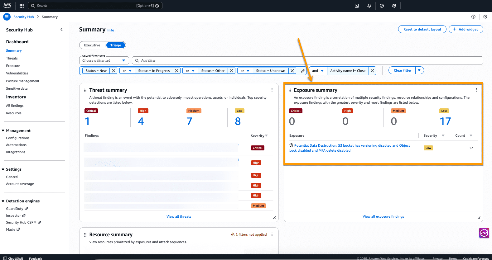

## Introduction

AWS Security Hub has been a central place for you to view and aggregate security alerts and compliance status across Amazon Web Services (AWS) accounts. AWS has released the preview release of the new AWS Security Hub which offers additional correlation, contextualization, and visualization capabilities. This helps you prioritize critical security issues, respond at scale to reduce risks, improve team productivity, and better protect your cloud environment.

## Integrations into AWS
AWS Security Hub integrates security capabilities like:

- Amazon GuardDuty
- Amazon Inspector
- AWS Security Hub Cloud Security Posture Management (CSPM)
- Amazon Macie

